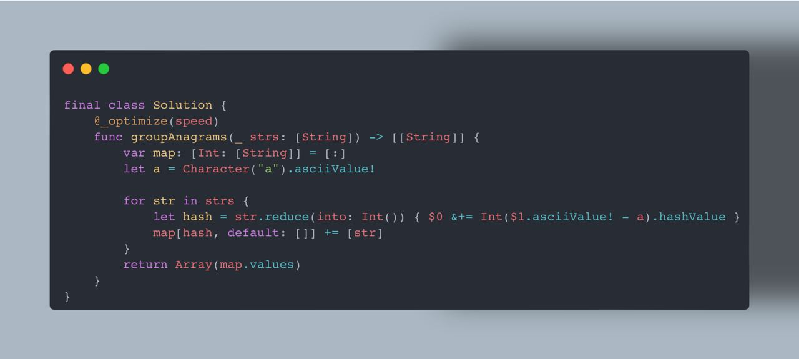

## Группировка анаграм

🌕 Сложность: легкая/средняя

## Дан массив строк strs, сгруппируйте анаграммы вместе. Вы можете вернуть ответ в любом порядке.

Примеры:

Входящие данные: `strs = ["eat","tea","tan","ate","nat","bat"]`

Ответ: `[["bat"],["nat","tan"],["ate","eat","tea"]]`

[Group Anagrams - LeetCode](https://leetcode.com/problems/group-anagrams/description/)

## Решения

By Astemir: https://github.com/eleev

