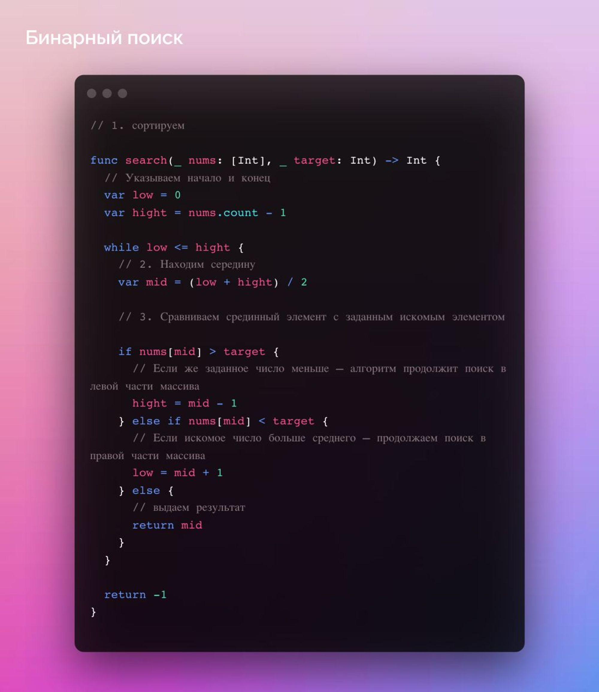

## Бинарный поиск

Почти все книги про алгоритмы начинаются с этого. Почему? Да потому что этот алгоритм лежит в основе системной функций сортировки, почти во всех языках.

В чем его идея?

Мы делим пополам заранее отсортированный массив, чтобы обнаружить нужный элемент. Вот и всё.

Алгоритм такой:

1. Сортируем массив данных
2. Делим его пополам и находим середину.
3. Сравниваем средний элемент с заданным искомым элементом.
4. Если искомое число больше среднего — продолжаем поиск в правой части массива (если он отсортирован по возрастанию): делим ее пополам, повторяя пункт 3. Если же заданное число меньше — алгоритм продолжит поиск в левой части массива, снова возвращаясь к пункту 3.

Ресурсы

[Алгоритм бинарного(двоичного) поиска на Swift, iOS разработка](https://www.youtube.com/watch?v=KDXjjOT4aFU)

[Расширение коллекций в Swift с помощью двоичного поиска](https://medium.com/nuances-of-programming/расширение-коллекций-в-swift-с-помощью-двоичного-поиска-581f4fdb6fd9)

[Алгоритм: Бинарный поиск](https://www.youtube.com/watch?v=R_jBj2sLITI)
